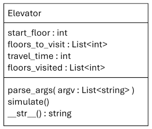

# Elevator Discrete Event Simulator

Implements a building elevator simulator with a start floor and path of floors to visit (Figure 1).

- elevator.py - class Elevator along with command line arguments
- test_elevator.py - test suite

With the Elevator, callers can 

- Set start floor and list of floors to visit
- Run simulation
- View results of travel time and floors visited

Figure 1. Elevator UML class diagram.
